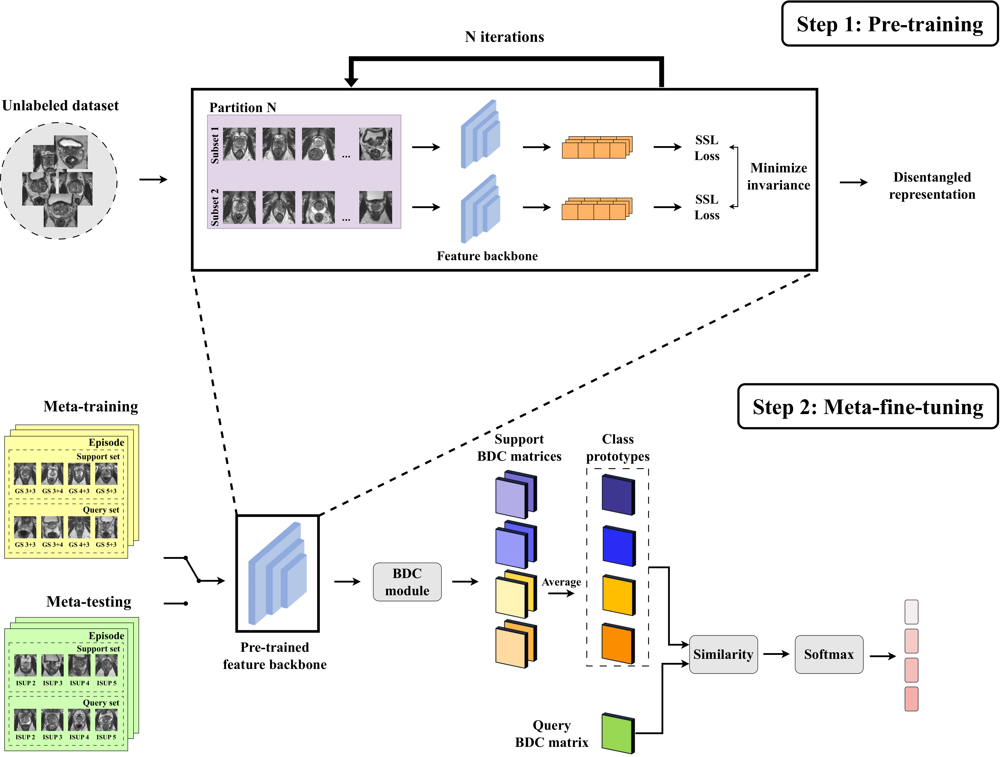

# Boosting Few-Shot Learning with Disentangled Self-Supervised Learning and Meta-Learning for Medical Image Classification
Official code for [**Boosting Few-Shot Learning with Disentangled Self-Supervised Learning and Meta-Learning for Medical Image Classification**](https://arxiv.org/abs/2403.17530) based on [DeepBDC](https://github.com/Fei-Long121/DeepBDC) by [FeiLong](https://github.com/Fei-Long121), pytorch code of [Joint Distribution Matters: Deep Brownian Distance Covariance for Few-Shot Classification](https://openaccess.thecvf.com/content/CVPR2022/papers/Xie_Joint_Distribution_Matters_Deep_Brownian_Distance_Covariance_for_Few-Shot_Classification_CVPR_2022_paper.pdf).

